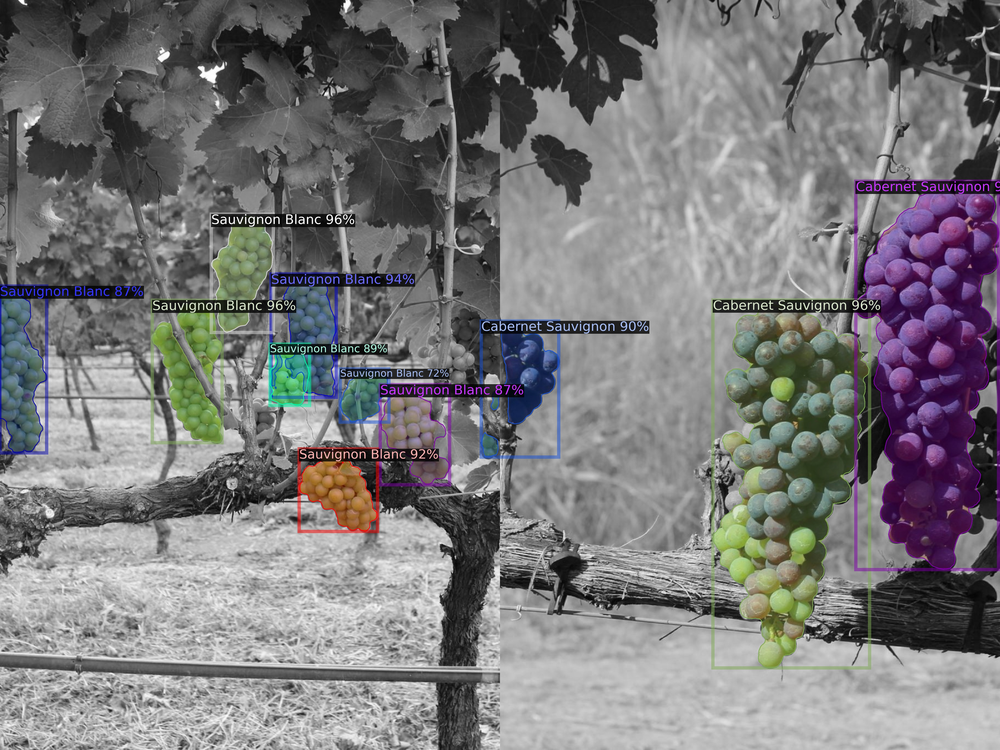
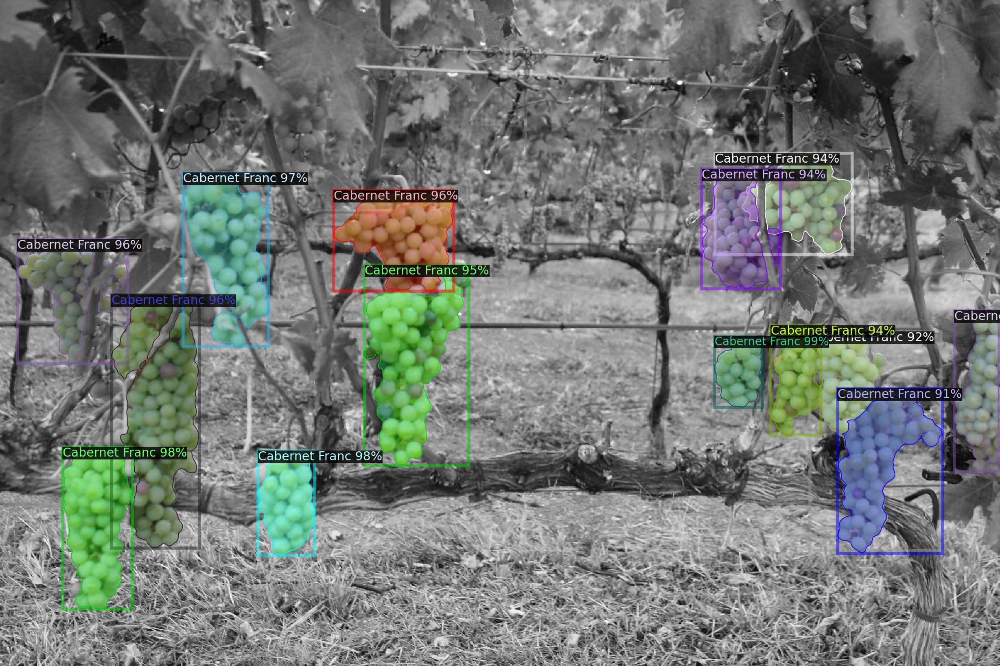

# Mask2Former. Instance segmentation on custom dataset.



## Introduction
Mask2Former significantly advances the integration of instance, semantic, and
panoptic segmentation tasks within a single framework. Mask2Former employs
a unified architecture that leverages **masked attention** and a dynamic mask-
prediction mechanism to achieve high accuracy across various segmentation
tasks.
The model’s key innovation lies in its ability to use mask attention, which allows
for more precise segmentation mask predictions by focusing on relevant parts of
the image

## Installation
- Linux or macOS with Python ≥ 3.6. CUDA 11.1
- PyTorch 1.10.1
```
pip install torch==1.10.1+cu111 torchvision==0.11.2+cu111 torchaudio==0.10.1 -f https://download.pytorch.org/whl/cu111/torch_stable.html
```
- Detectron2
```
python -m pip install detectron2 -f https://dl.fbaipublicfiles.com/detectron2/wheels/cu111/torch1.10/index.html
python -m pip install 'git+https://github.com/facebookresearch/detectron2.git'
```
- Clone this repository, go  to it and run `pip install -r requirements.txt`
- Download weights from [here](https://dl.fbaipublicfiles.com/maskformer/mask2former/coco/instance/maskformer2_swin_base_384_bs16_50ep/model_final_f6e0f6.pkl) and store them into **mask2former-custom-instance-segmentation/weights** folder, so the path will look like `mask2former-custom-instance-segmentation/weights` and inside **weights** folder **.pkl** file. Also name that file as `swin_base_patch4_window12_384.pkl`.

## Prepare dataset
Make dataset in COCO format (annotations should be in [Object Detection](https://cocodataset.org/#format-data) format).
```
coco/
  annotations/
    instances_train2017.json
    instances_val2017.json
  train2017/
    # image files that are mentioned in the corresponding json
  val2017/
    # image files that are mentioned in the corresponding json
```

Name all the directories and .json files **exactly** how it was done in the example above.

## Change configuration files for metrics of your dataset. 

Firstly, you need to go to `configs/coco/instance-segmentation` and change in file `maskformer2_R50_bs16_50ep.yaml` line `7` to number of classes, that you are using in your dataset.

```
  NUM_CLASSES: 5 #change here
```
Secondly you need to fix iterations-metrics (MAX_ITER, STEPS, WARMUP_ITERS and
EVAL_PERIOD parameters in configuration file), so they will be suitable for your dataset. 

Initially `maskformer2_swin_base_384_bs16_50ep.yaml` was made for model, that will train on `50`  epoches with batch size of `16`. We are training only on one GPU, so we needed to decrease batch size to `2`, keeping number of epoches `50`
```
MAX_ITER = num_epochs * training_samples / batch_size
MAX_ITER = 50 * 110 / 2 = 2750

STEPS = (0.89 * MAX_ITER, 0.96 * MAX_ITER)
STEPS = (2447, 2640)

WARMUP_ITERS = 5 (if MAX_ITER < 100000)
WARMUP_ITERS = 10 (otherwise)

EVAL_PERIOD = 0.0135 * MAX_ITER
EVAL_PERIOD = 37
```

After all calculations you need to go to `configs/coco/instance-segmentation/swin` and change in file `maskformer2_swin_base_384_bs16_50ep.yaml` iteration metrics : MAX_ITER, STEPS, WARMUP_ITERS and
EVAL_PERIOD.
```
SOLVER:
  IMS_PER_BATCH: 2
  MAX_ITER: 2750 #change here
  STEPS: (2447, 2640) #change here
  WARMUP_ITERS: 5 #change here
TEST:
  EVAL_PERIOD: 37 #change here
```
## Train 
Run `train_net.py` with corresponding configuration file like this:
```
cd src
export DATA_PATH=path/to/your/coco/dataset
python train_net.py --config-file ../configs/coco/instance-segmentation/swin/maskformer2_swin_base_384_bs16_50ep.yaml --num-gpus 1
```
Logs, metrics and weights after training will be saved in new directory `src/output`. (don't forget to clean it before, so new metrics won't overlap the old ones).

## Inference check
By default we are not using bounding boxes (”instance segmentation is not
object detection and thus does not require bbox predictions.”) for training part,
because generated boxes are very sensitive to outliers.

But bounding boxes can be extracted for inference.

For that there should be before inference uncommented line `374` in `mask2former/maskformer_model.py`.

For inference check run 
```
python demo_with_bboxes.py
```
And compare the rusult with this:



## Hyperparameter optimization
```
cd src
export DATA_PATH=path/to/your/coco/dataset
python hyperparameters.py --config-file ../configs/coco/instance-segmentation/swin/maskformer2_swin_base_384_bs16_50ep.yaml --num-gpus 1
```
